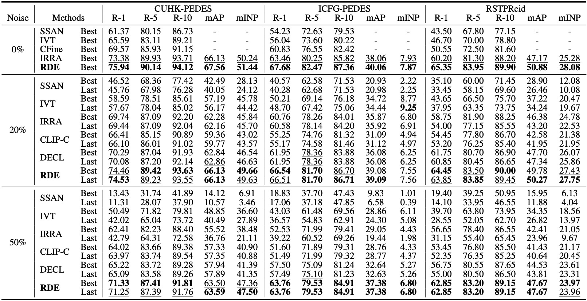

[](https://paperswithcode.com/sota/text-based-person-retrieval-with-noisy?p=noisy-correspondence-learning-for-text-to)
## Introduction
PyTorch implementation for [Noisy-Correspondence Learning for Text-to-Image Person Re-identification](./src/RDE_main.pdf) (CVPR 2024). The solution to [the noisy correspondence problem](https://github.com/QinYang79/Noisy-Correspondence-Summary)  in TIReID.

⚠️⚠️⚠️ 20241128 - Fixing [issue 8](https://github.com/QinYang79/RDE/issues/8) will cause some performance degradation in noisy scenes. You can comment out "line217 model.train()" in processor/processor.py. Thanks to *Xiangwen Deng* for pointing this out.

### News!

- We release the pre-trained model weights and training logs (0% noise), [here](https://huggingface.co/Yangsss/RDE).
- Accepted by CVPR 2024.
- We will post in VALSE 2024 (Chongqing, China). The poster can be found [here](./src/valse_poster.pdf).
- We will post in CVPR 2024 (Seattle, Washington, USA). The poster can be found [here](./src/poster.png).


### RDE framework
The overview of our RDE. (a) is the illustration of the cross-modal embedding model used in RDE, which consists of *basical global embedding* (BGE) and *token selection embedding* (TSE) modules with different granularity. By integrating them, RDE can capture coarse-grained cross-modal interactions while selecting informative local token features to encode more fine-grained representations for a more accurate similarity. (b) shows the core of RDE to achieve robust similarity learning, which consists of Confident Consensus Division (CCD) and Triplet Alignment Loss (TAL). CCD performs consensus division to obtain confident clean training data, thus avoiding misleading from noisy pairs. Unlike traditional Triplet Ranking Loss (TRL), TAL exploits an upper bound to consider all negative pairs, thus embracing more stable learning.


## Requirements and Datasets
- Same as [IRRA](https://github.com/anosorae/IRRA)

### Noise index
If you want to experiment with the same noise index as in the paper, the noise index files can be found in [2024-CVPR-RDE/noiseindex](https://github.com/QinYang79/RDE/tree/main/2024-CVPR-RDE/noiseindex).


## Training and Evaluation

### Training new models

```
sh run_rde.sh
```

### Evaluation
Modify the  ```sub``` in the ```test.py``` file and run it.
```
python test.py
```

 

### Experiment Results:



## Citation
If RDE is useful for your research, you can cite the following papers:
```
@inproceedings{qin2024noisy,
  title={Noisy-Correspondence Learning for Text-to-Image Person Re-identification},
  author={Qin, Yang and Chen, Yingke and Peng, Dezhong and Peng, Xi and Zhou, Joey Tianyi and Hu, Peng},
  booktitle={IEEE International Conference on Computer Vision and Pattern Recognition (CVPR)},
  year={2024},
}
```

```
@article{qin2023cross,
  title={Cross-modal Active Complementary Learning with Self-refining Correspondence},
  author={Qin, Yang and Sun, Yuan and Peng, Dezhong and Zhou, Joey Tianyi and Peng, Xi and Hu, Peng},
  journal={Advances in Neural Information Processing Systems},
  volume={36},
  year={2023}
}
```

```
@inproceedings{qin2022deep,
  title={Deep evidential learning with noisy correspondence for cross-modal retrieval},
  author={Qin, Yang and Peng, Dezhong and Peng, Xi and Wang, Xu and Hu, Peng},
  booktitle={Proceedings of the 30th ACM International Conference on Multimedia},
  pages={4948--4956},
  year={2022}
}
```

## License

[Apache License 2.0](http://www.apache.org/licenses/LICENSE-2.0)

## Acknowledgements
The code is based on [IRRA](https://github.com/anosorae/IRRA) licensed under Apache 2.0.
